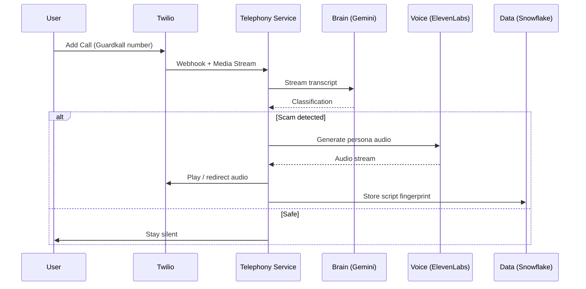

# Architecture

## High-level components
- Telephony service (Node.js on DigitalOcean): Twilio webhooks, media streams, call control.
- Brain service (Gemini via Google AI Studio or OpenRouter): live transcript analysis and threat detection.
- Voice service (ElevenLabs): generates the time-waster persona voice.
- Data service (Snowflake API): stores scam script fingerprints and matches new calls.

## Data flow
1) Twilio call connects and starts Media Stream to telephony service.
2) Telephony service streams audio to speech-to-text (TBD) and sends text to Brain.
3) Brain returns classification (SAFE / SUSPICIOUS / SCAM) with confidence and reasons.
4) On SCAM, telephony service triggers Voice service to speak and switch role.
5) Data service stores new scam script fingerprints for future matching.

## Sequence (Mermaid)

## Deployment
- Telephony service on DigitalOcean droplet.
- Optional: other services on the same droplet or managed platforms.

## Security & privacy
- Do not store raw audio by default.
- Redact sensitive data in logs.
- Encrypt Snowflake credentials and transport.
